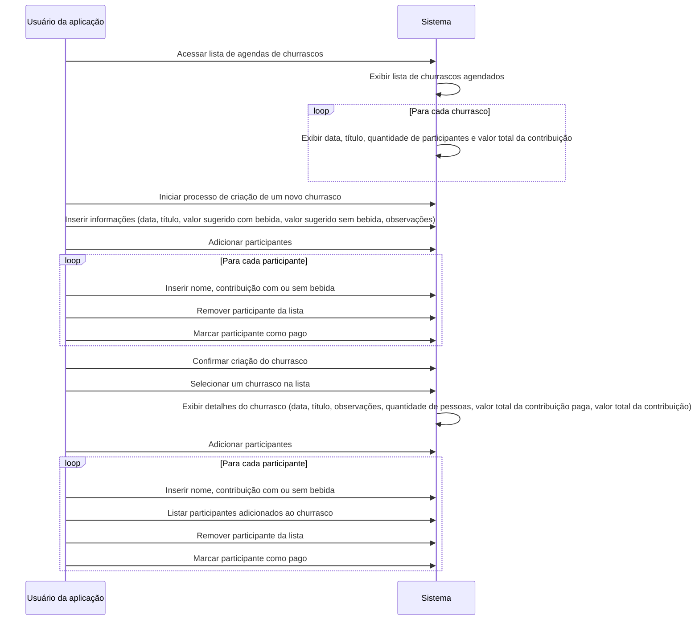

[](https://github.com/mpluiz/trichurras/actions/workflows/ci.yml)
[](https://app.netlify.com/sites/trichurras/deploys)


# TRICHURRAS

- [app](https://trichurras.mpluiz.com.br)
- [storybook](https://storybook.trichurras.mpluiz.com.br)

## Roadmap
- E2E Test with Cypress
- Internationalization with i18n
- 100% test coverage

## Technologies
- Typescript
- React
- React Router
- Vite
- Vitest
- Storybook


## Requirements
- Node `<lts-version>`

## Installation

Instructions to install dependencies and start the dev server\
put required variables in the `env` file*

```bash
cd <your-project-name>
npm i
npm run dev
```

## Automatic Installation with docker-compose

This command will go up to the `localhost` domain with the application on port `8080` 
and storybook on port `6060`

```bash
docker-compose -up -d
```

## Tests

Instructions to run tests

```bash
  npm run test
```

Commands for tests

```bash
  npm run test:watch
  npm run test:ci
```

Coverage Report

```bash
  npm run test:coverage
```

## Storybook

Instructions to start storybook

```bash
  npm run storybook
```

## Documentation

### Architecture

The architecture used in this project was the Clean Architecture, using the concepts proposed by Robert Martin.


```
src/
  application/
    protocols/
    usecases/
  domain/
    entities/
  infra/
    database/
    cache/
  main/
    adapters/
    factories/
    routes/
  presentation/
    assets/
    components/
    hooks/
    pages/
tests/
    factories/
    services/
```

### Diagram



### Usecases
```
1.Listar Agenda de Churrascos:
- Ator Principal: Usuário da aplicação
- Fluxo Principal:
    1. O usuário acessa a lista de agendas de churrascos.
    2. O sistema exibe uma lista de churrascos agendados, incluindo data, título, quantidade de participantes e valor total da contribuição.

2.Adicionar um Churrasco:
- Ator Principal: Usuário da aplicação
- Fluxo Principal:
    1. O usuário inicia o processo de criação de um novo churrasco.
    2. O usuário insere informações como data, título, valor sugerido com bebida, valor sugerido sem bebida e observações.
    3. O usuário pode adicionar participantes, inserindo detalhes como nome, contribuição com ou sem bebida.
    4. O usuário pode remover participantes da lista.
    5. O usuário pode marcar participantes como pagos.
    6. O usuário confirma a criação do churrasco.

3.Ver Detalhes do Churrasco:
- Ator Principal: Usuário da aplicação
- Fluxo Principal:
    1. O usuário seleciona um churrasco específico na lista.
    2. O sistema exibe uma página de detalhes do churrasco, incluindo data, título, observações, quantidade de pessoas, valor total da contribuição paga e valor total da contribuição.
    3. O usuário pode adicionar participantes, inserindo detalhes como nome, contribuição com ou sem bebida.
    4. O usuário pode listar os participantes adicionados ao churrasco.
    5. O usuário pode remover participantes da lista.
    6. O usuário pode marcar participantes como pagos.
```

## Documentation reference
- [The Clean Architecture](https://blog.cleancoder.com/uncle-bob/2012/08/13/the-clean-architecture.html)
- [Typescript](https://www.typescriptlang.org/docs/)
- [React](https://react.dev/reference/react)
- [React Router](https://reactrouter.com/en/main/start/overview)
- [Testing Library](https://testing-library.com/docs/react-testing-library/intro/)
- [Vite](https://vitejs.dev/guide/)
- [Vitest](https://vitest.dev/guide/)
- [Github API](https://docs.github.com/en/rest/guides/getting-started-with-the-rest-api?apiVersion=2022-11-28)

## How to contribute

- Make a fork of this repository;
- Create a branch with your feature: `git checkout -b <your-branch>`;
- Make a commit : `git commit -m '<commit-message>'`;
- Push to your branch: `git push <origin> your-branch`;

## License

[MIT](https://choosealicense.com/licenses/mit/)
